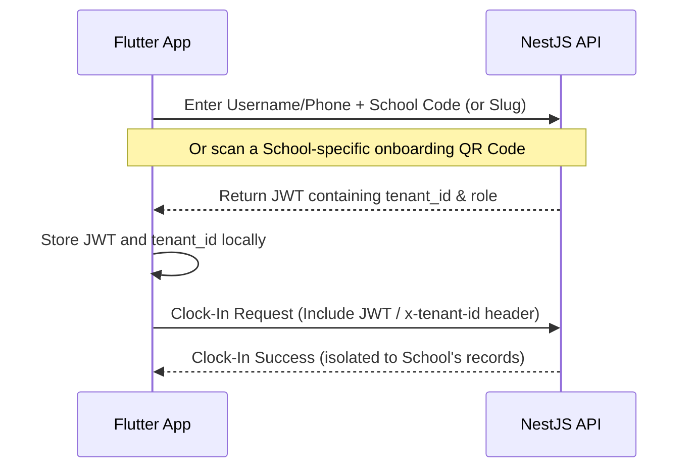

# Multi-Tenant SaaS Architecture Plan: TK Clocking System

This document outlines the architectural blueprint to transform the **TK Clocking System** from a single-tenant system into a multi-tenant SaaS platform where multiple schools, companies, or organizations can co-exist securely.

```mermaid
graph TD
    subgraph Clients
        subgraph Subdomains
            SA["school-a.tkclocking.com (Next.js)"]
            SB["school-b.tkclocking.com (Next.js)"]
        end
        Mobile["Flutter App (Multi-Tenant Login)"]
    end

    subgraph API Gateway / Backend (NestJS)
        AuthGuard["JWT Tenant Extraction Guard"]
        TenantContext["Tenant Context Provider"]
        NestApp["NestJS Services"]
    end

    subgraph Database (Supabase PostgreSQL)
        subgraph Shared DB / Shared Schema
            TenantsTable[("tenants table")]
            RLS["Row Level Security (RLS) Filter"]
            DataTable[("users, employees, attendance, branches...")]
        end
    end

    SA --> AuthGuard
    SB --> AuthGuard
    Mobile --> AuthGuard
    AuthGuard --> TenantContext
    TenantContext --> NestApp
    NestApp --> RLS
    RLS --> DataTable
    TenantsTable -.-> RLS
```

---

## 1. Architectural Strategy Selection

To achieve the best balance of cost, performance, maintenance, and speed-to-market, we will use a **Shared Database, Shared Schema (Discriminator Column)** strategy, backed by **Supabase Row-Level Security (RLS)**.

| Strategy | Data Isolation | Infrastructure Cost | Schema Migrations | Analytics / Reporting |
| :--- | :--- | :--- | :--- | :--- |
| **Option A: Separate DBs** | 🌟 Maximum | 💸 Very High | 🛠️ Extremely Complex | 📈 Hard |
| **Option B: Separate Schemas** | 🟢 High | 🟡 Medium | 🟡 Complex | 🟡 Medium |
| **Option C: Shared DB + Discriminator (Chosen)** | 🟡 Good (Enforced via RLS/App Code) | 🟢 Extremely Low | 🟢 Extremely Simple | 🟢 Very Easy |

### Why this is perfect for your stack:
1. **Supabase Integration**: Supabase's native **Row Level Security (RLS)** allows PostgreSQL itself to block queries that don't match the user's `tenant_id`. This prevents cross-school data leakage even if a developer forgets a `WHERE` clause in the backend code.
2. **Next.js & Subdomains**: Next.js can dynamically resolve school branding based on subdomains (e.g., `school-a.tkclocking.com`).
3. **Flutter Configuration**: Employees log in once, and the app routes their clock-in requests using their assigned `tenant_id`.

---

## 2. Phase-by-Phase Implementation Blueprint

### Phase 1: Database & Schema Changes

To turn your entities into multi-tenant tables, every tenant-specific record must point to a master `tenants` (or `schools`) table.

#### 1. Create a `Tenant` Entity
```typescript
// backend/src/modules/tenants/tenant.entity.ts
import { Entity, PrimaryGeneratedColumn, Column, CreateDateColumn, UpdateDateColumn } from 'typeorm';

@Entity('tenants')
export class Tenant {
  @PrimaryGeneratedColumn('uuid')
  id: string;

  @Column({ unique: true })
  slug: string; // e.g., 'greenwood-high' for greenwood-high.tkclocking.com

  @Column()
  name: string; // e.g., 'Greenwood High School'

  @Column({ name: 'logo_url', nullable: true })
  logoUrl: string;

  @Column({ default: true })
  isActive: boolean;

  @CreateDateColumn({ name: 'created_at' })
  createdAt: Date;

  @UpdateDateColumn({ name: 'updated_at' })
  updatedAt: Date;
}
```

#### 2. Relate Other Entities to the Tenant
Update **Users**, **Employees**, **Branches**, **Attendance**, **Shifts**, and **AcademicCalendar** to belong to a `Tenant`:

```typescript
// Example: Adding tenant relation in backend/src/modules/users/user.entity.ts
@Column({ name: 'tenant_id', type: 'uuid' })
tenantId: string;

@ManyToOne(() => Tenant, { onDelete: 'CASCADE' })
@JoinColumn({ name: 'tenant_id' })
tenant: Tenant;
```

#### 3. Supabase Row Level Security (RLS) Configuration
Enable RLS on all tables and create a policy using JWT claims:
```sql
-- Enable RLS on attendance
ALTER TABLE attendance ENABLE ROW LEVEL SECURITY;

-- Create policy allowing users to only view records matching their tenant ID
CREATE POLICY tenant_isolation_policy ON attendance
AS RESTRICTIVE
USING (tenant_id = (auth.jwt() ->> 'tenant_id')::uuid);
```

---

### Phase 2: Backend Architecture (NestJS & TypeORM)

We must ensure that every request dynamically isolates and injects `tenantId` into database operations without hardcoding it in every query.

#### 1. Create a Tenant Context Middleware / Guard
Extract the tenant from the authenticated JWT token or a special request header `x-tenant-slug` / subdomain.

```typescript
// backend/src/common/middleware/tenant.middleware.ts
import { Injectable, NestMiddleware } from '@nestjs/common';
import { Request, Response, NextFunction } from 'express';
import { AsyncLocalStorage } from 'async_hooks';

// AsyncLocalStorage allows storing request-specific context (like tenantId) 
// without passing it manually through every function argument
export const tenantStorage = new AsyncLocalStorage<string>();

@Injectable()
export class TenantMiddleware implements NestMiddleware {
  use(req: Request, res: Response, next: NextFunction) {
    // 1. Check custom header (e.g. from Flutter/NextJS) or JWT
    const tenantId = req.headers['x-tenant-id'] as string || req.user?.tenantId;
    
    if (tenantId) {
      tenantStorage.run(tenantId, () => next());
    } else {
      next();
    }
  }
}
```

#### 2. Create a Global Tenant Filter in TypeORM
We can automate the injection of `tenant_id` by subscribing to TypeORM database query events or using a Base Repository.

```typescript
// backend/src/common/repositories/tenant-bound.repository.ts
import { Repository, FindManyOptions, FindOneOptions } from 'typeorm';
import { tenantStorage } from '../middleware/tenant.middleware';

export class TenantBoundRepository<T> extends Repository<T> {
  override find(options?: FindManyOptions<T>): Promise<T[]> {
    const tenantId = tenantStorage.getStore();
    if (tenantId) {
      options = options || {};
      options.where = { ...options.where, tenantId } as any;
    }
    return super.find(options);
  }

  // Override other methods (findOne, update, delete, save) similarly...
}
```

---

### Phase 3: Frontend Web Dashboard (Next.js)

The web dashboard needs to identify the school before the user even logs in, so it can display the correct logo and theme.

#### 1. Dynamic Subdomain Setup (Multi-Tenant Routing)
In Next.js, we use a custom Middleware (`middleware.ts`) to rewrite incoming requests based on the subdomain.

```typescript
// dashboard/src/middleware.ts
import { NextResponse } from 'next/server';
import type { NextRequest } from 'next/server';

export function middleware(request: NextRequest) {
  const url = request.nextUrl.clone();
  const hostname = request.headers.get('host') || '';

  // Exclude main domains & local host names
  const isLocalhost = hostname.includes('localhost');
  const domainParts = hostname.split('.');

  // Detect subdomain: school-a.tkclocking.com -> school-a
  let subdomain = '';
  if (isLocalhost) {
    // Under localhost: sub.localhost:3000 -> sub
    if (domainParts.length > 1 && domainParts[0] !== 'localhost') {
      subdomain = domainParts[0];
    }
  } else if (domainParts.length > 2) {
    subdomain = domainParts[0];
  }

  if (subdomain && subdomain !== 'www' && subdomain !== 'app') {
    // Rewrite path to a dynamic tenant route secretly
    url.pathname = `/_tenants/${subdomain}${url.pathname}`;
    return NextResponse.rewrite(url);
  }

  return NextResponse.next();
}
```

#### 2. Tenant Dynamic Branding
Create a page `_tenants/[tenantSlug]/login/page.tsx` that fetches the logo and primary colors of the specific school based on `tenantSlug` before showing the login screen.

---

### Phase 4: Mobile App Architecture (Flutter)

The mobile app must know which school's database to hit.



#### 1. Login Authentication Payload
Update the Flutter login endpoint payload to accept a tenant identifier (like `schoolCode` or `tenantSlug`):
```json
{
  "username": "john_doe",
  "password": "hashed_password",
  "tenantSlug": "greenwood-high"
}
```

#### 2. Multi-Tenant Branch QR Codes
Since different schools will have physical branches with QR codes:
* The branch QR codes should contain both a `branchId` and a `tenantId`.
* When the Flutter app scans a branch QR, it must verify:
  `scannedTenantId == loggedInUserTenantId`. This prevents employees of School A from clocking in at a physical branch belonging to School B!

---

## 3. Migration Plan (Single to Multi-Tenant)

If you have existing live data in production, you must migrate it without downtime:

1. **Step 1**: Create a "Default" Tenant in your database (e.g., `'TK Clocking default'`).
2. **Step 2**: Add `tenant_id` columns to all relevant tables, making them nullable at first.
3. **Step 3**: Run a migration script to set all existing records' `tenant_id` to the ID of the default tenant.
4. **Step 4**: Alter columns to set `NOT NULL` constraints on `tenant_id` once all existing records are associated.
5. **Step 5**: Deploy the updated backend code, which enforces tenant-isolation filters globally.
